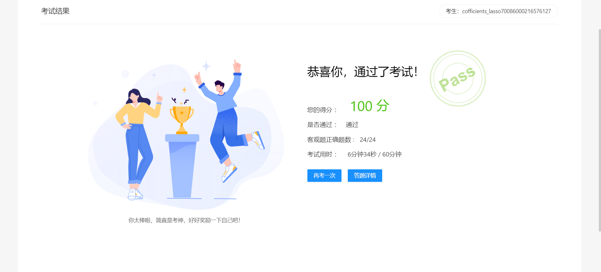

# Ascend_C-notebook

## 前情概要

- 故事要从一个朴实无华的下午说起。。。老师找到我，问ff，有没有兴趣参加hw的一个活动。活动的大概内容是找一群“开发者”同学过去听讲座，吃吃饭，看同学答题。
- 我看到是类似开放日的，有吃有喝的，本着学术蝗虫的念头我就参加了报名。
- 活动前期的安排是我们各自答题，根据答题情况来打分，最后活动日当天每个学校选出两位分数排位靠前的同学玩一个“一站到底”的活动。
- 我那会专注于即将来临的机器学习考试，对于这个活动的题目我只是很浅地研究了一下，把华为账号里剩余的三十来块钱花完了。
- 还充了我十来元进去，到死了华为云服务器都没玩明白。
- 我就想着差不多得了，题目做不出来不做了我还要赶着复习，用ChatGPT和官方参考代码糊弄了一份答案上去。

- 结果我自食苦果了。。。

- 我怎么能是我们学校靠前的呢？我分数全不是凭我自己的实力，课程我都只草看了一半。

- 现在只好抽出考完试gap day的休息时间，开一个仓库，好好把Ascend CL的相关知识恶补一下。

- 要死了，周六活动周五晚上的答辩还没准备好。。。多给几天不行啊（瘫）

## 准备进展

- 把答辩准备好，答辩又推迟力！
- 小小地准备了一下Ascend CL的相关知识，u1s1，这方面的资料还真是挺难找的，不是国内的主流，比较偏。

- whatever，把考核满分过了，记录一下。

- 明天准备去吃大餐。

