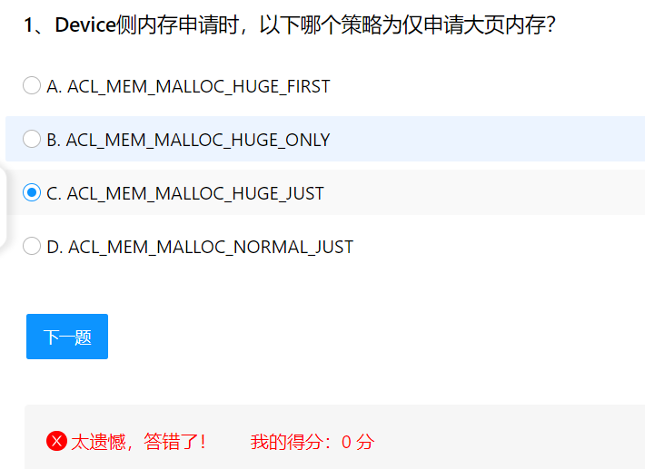
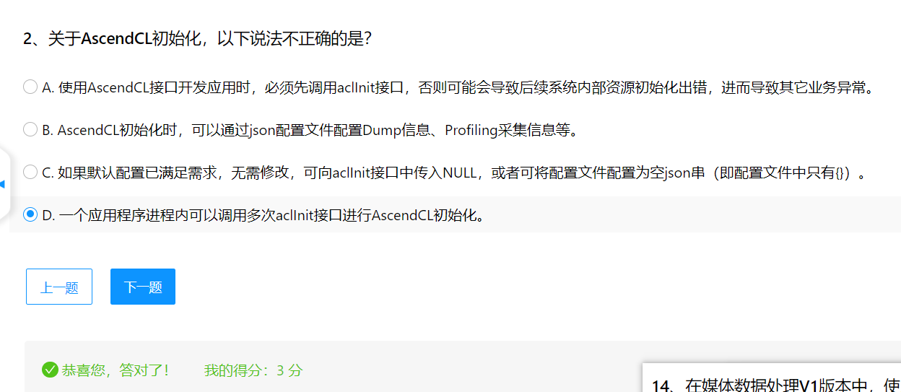
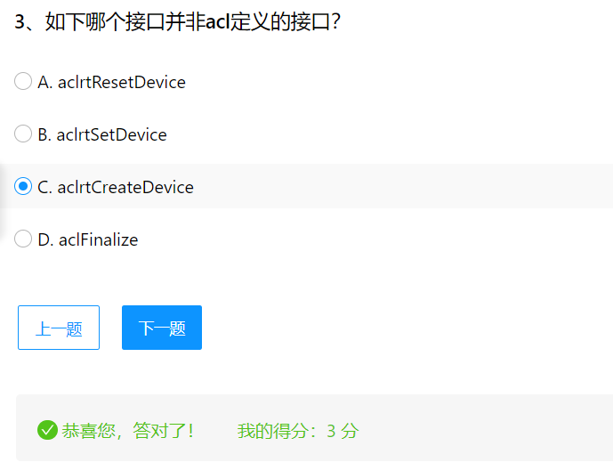
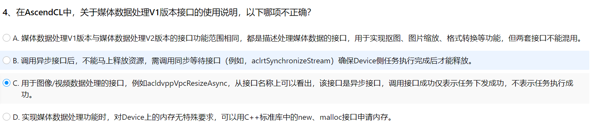
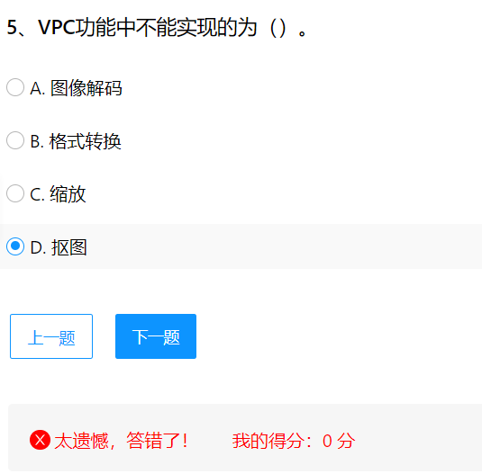

正确答案应该选B，从翻译即可得知

一个进程内只调用一次aclInt接口进行AscendCl初始化，同时最后应该使用aclFinalize进行清理。

aclrtResetDevice用于重置设备的接口
aclrtSetDevice设置当前使用的设备
aclFinalize用于释放AscendCL的资源，是程序结束时调用的接口。
aclrtCreateContext、aclrtDestroyContext用于创建和销毁AscendCL运行时上下文。
aclrtMalloc、aclrtFree用于分配和释放AscendCL内存。
aclrtMemcpy、aclrtMemcpyAsync用于AscendCL内存拷贝。
aclrtStreamCreate、aclrtStreamDestroy用于创建和销毁AscendCL流。
aclrtSubscribe、aclrtUnsubscribe用于AscendCL事件订阅和取消订阅。
aclrtRunMode、aclrtGetRunMode用于AscendCL运行模式的获取和设置。
aclrtGetRunMode、aclrtSetRunMode用于AscendCL运行模式的获取和设置。
aclrtGetTaskId、aclrtGetTaskType用于AscendCL任务的获取。
aclrtCreateEvent、aclrtDestroyEvent用于AscendCL事件的创建和销毁。
aclrtRecordEvent、aclrtSyncEvent用于AscendCL事件的记录和同步。
aclrtGetEventInfo用于AscendCL事件的获取。
aclrtGetMemInfo用于AscendCL内存信息的获取。

而aclrtCreateDevice不存在于acl的接口定义中

前三项都是正确的。
A项：媒体数据处理V1版本与V2版本的接口功能范围相同，但接口的实现和使用方法可能有所不同，不能混用。
B项：调用异步接口后，需要确保任务在设备侧执行完成后才能释放相关资源，以避免未定义行为或资源泄露。
C项：acldvppVpcResizeAsync接口中的Async表示这个接口是异步（Asynchronous）接口。
D项：用于媒体数据处理的接口对Device上的内存有特定的要求，通常需要使用Ascend提供的内存分配接口（如aclrtMalloc）来保证内存的正确分配和对齐。

应选A图像解码。
VPC功能模块实现的主要是图像和视频的预处理操作，图像的解码功能有JpegD、PngD这些DVPP模块下的子模块实现。
