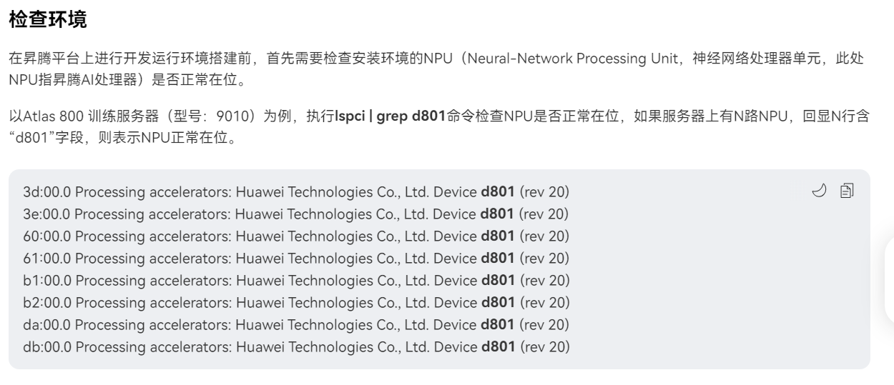
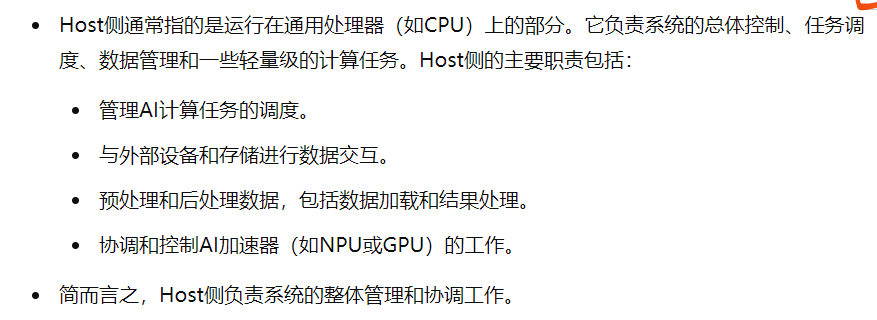
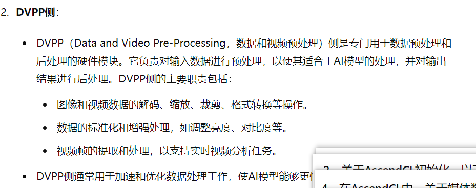
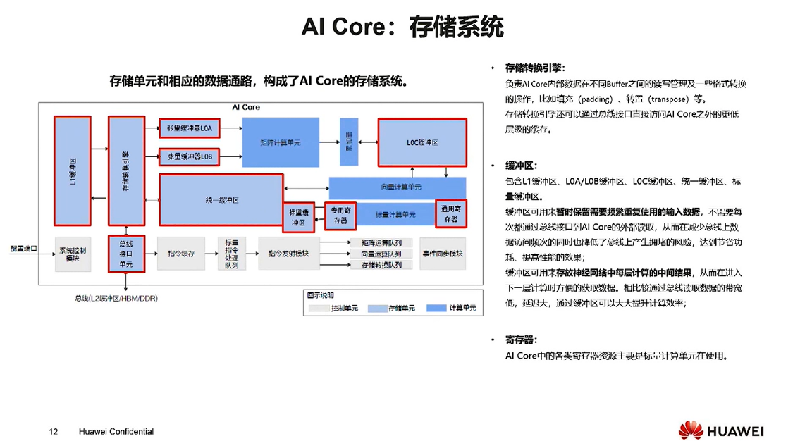
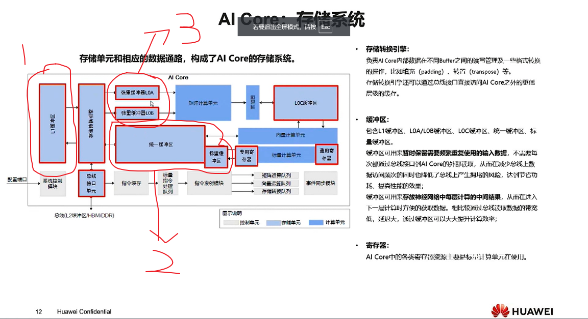
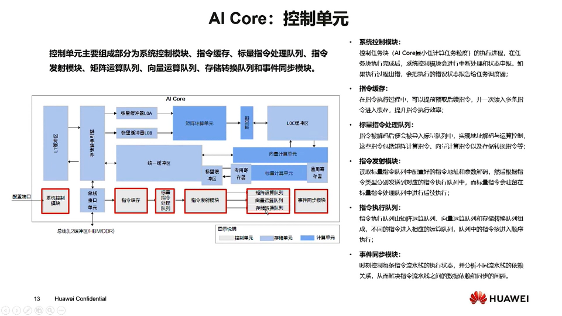
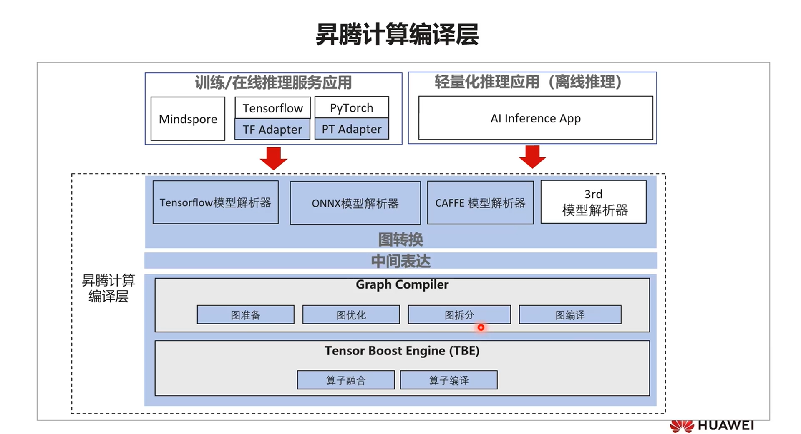
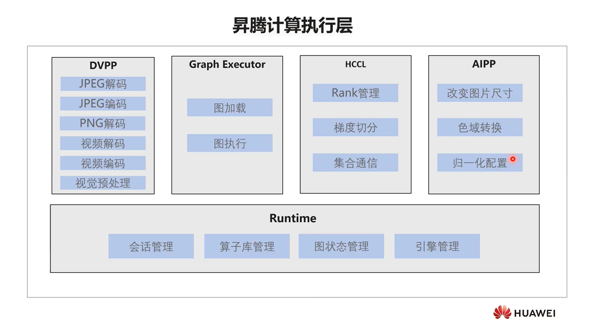

## AI Core硬件结构

### 缓冲结构

- 
- 包含三类缓冲结构。
1. 第一种是L1缓冲区，功能是用来缓冲AI Core与外部的交互。
2. 第二种是统一缓冲区（+标量缓冲区），功能是AI Core中内部交互的缓冲，也就是标量计算、向量计算、矩阵计算之间公用的缓冲。
3. 第三种是张量缓冲区，是AI Core中矩阵计算专用的缓冲区。

### 控制单元

- 有以下几种特点，矩阵运算、向量计算和标量计算是并行的，有独立的指令发射模块和指令队列，不同的指令进入相应的运算队列，队列中的指令按进入顺序执行。
- 同时为了同步，还设置了事件同步模块
- 指令缓存可以一次读入多条指令进入缓存。
- 同时指令执行时可以通过set flag的方式确定指令的依赖关系。通过事件同步模块实现事件的发布与并列。

## AI Core逻辑架构
### 编译层

### 执行层
